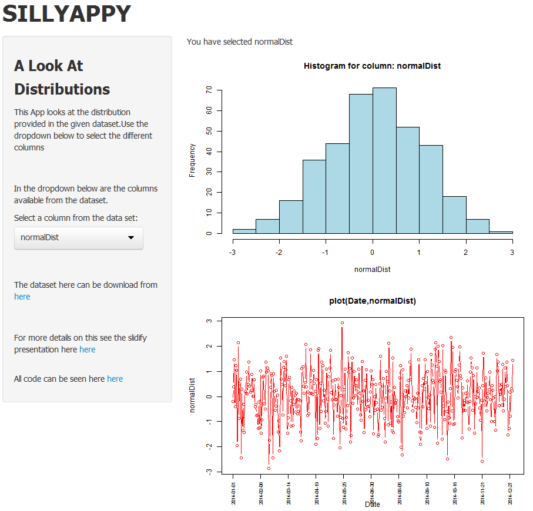

---
title       : SILLYAPPY
subtitle    : A look at Distributions
author      : Distro Butions
job         : Distributions King
framework   : io2012        # {io2012, html5slides, shower, dzslides, ...}
highlighter : highlight.js  # {highlight.js, prettify, highlight}
hitheme     : tomorrow      # 
widgets     : []            # {mathjax, quiz, bootstrap}
mode        : selfcontained # {standalone, draft}
knit        : slidify::knit2slides
--- .black .quote

<q> <span class = 'green'>SillyAppy</span> at the click of a button</q>
<br>
<q> <span class = 'green'>SillyAppy</span> brings you a view of different distriibutions.</q>
<br>

--- .black .quote

## <span class = 'green'>Here is a look at the dataset<span>

    
    ```
    ##         Date normalDist poissonDist bernoulliDist binomialDist
    ## 1 2014-01-01 -0.2071097           1             0            1
    ## 2 2014-01-02  0.3949326           2             0            1
    ## 3 2014-01-03  1.4592240           2             0            1
    ## 4 2014-01-04 -0.4022046           1             1            0
    ## 5 2014-01-05  1.2277248           0             0            1
    ##   multinomDist.1 multinomDist.2
    ## 1            365            365
    ## 2            365            365
    ## 3            365            365
    ## 4            365            365
    ## 5            365            365
    ```


--- .black .quote

## <span class = 'green'>SillyAppy At Work<span>




--- .black .quote

## <span class = 'green'>SillyAppy Always Looking For More TO DOs::<span>

* TO DO:: display table of dataframe
* TO DO:: would like to control the format here e.g. h3
* TO DO:: Would like to be able to import a file building on [this](https://github.com/rstudio/shiny-examples/tree/master/066-upload-file) then this would build the dropdown menus, and other options. that way it is more dynamic.
* TO DO:: Handle many different file formats/structures.
* TO DO:: More opions on the graphs to display.
